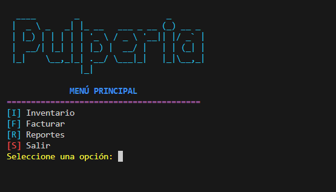

# Sistema de Gestión Pulperia ConsolApp

## Descripción
Sistema de consola en Python para gestionar inventario y acceso en una pulperia con archivos de texto.

## Objetivo
Practicar CRUD simple, autenticación básica y persistencia local para comercio pequeño.

## Tecnologías utilizadas
- Python 3
- Consola
- Archivos .txt

## Funcionalidades principales
- Gestión de inventario
- Archivo de acceso
- Interfaz de consola
- Persistencia en Inventario.txt

## Mi rol
Implementé flujo principal, validaciónes y lectura/escritura de inventario.

## Aprendizajes clave
- CRUD consola
- Archivos planos
- Validación
- Scripts Python

## Instalación y ejecución
```bash
cd SistemaDeGestionPulperia-ConsolApp/programa
python Proyecto1.py
```

## Estructura del proyecto
- Proyecto1.py: app
- Inventario.txt: datos
- Acceso.txt: acceso
- screenshots/: captura

## Capturas o demo


## Estado del proyecto
Proyecto académico funcional.

## Valor técnico demostrado
Demuestra automatización administrativa simple con Python.

## Mejoras futuras
- Separar módulos
- Agregar respaldos
- Migrar a SQLite

## Autor
Geovanni González  
Estudiante de Ingeniería en Computación  
GitHub: [Geovanni-Gonzalez](https://github.com/Geovanni-Gonzalez)


